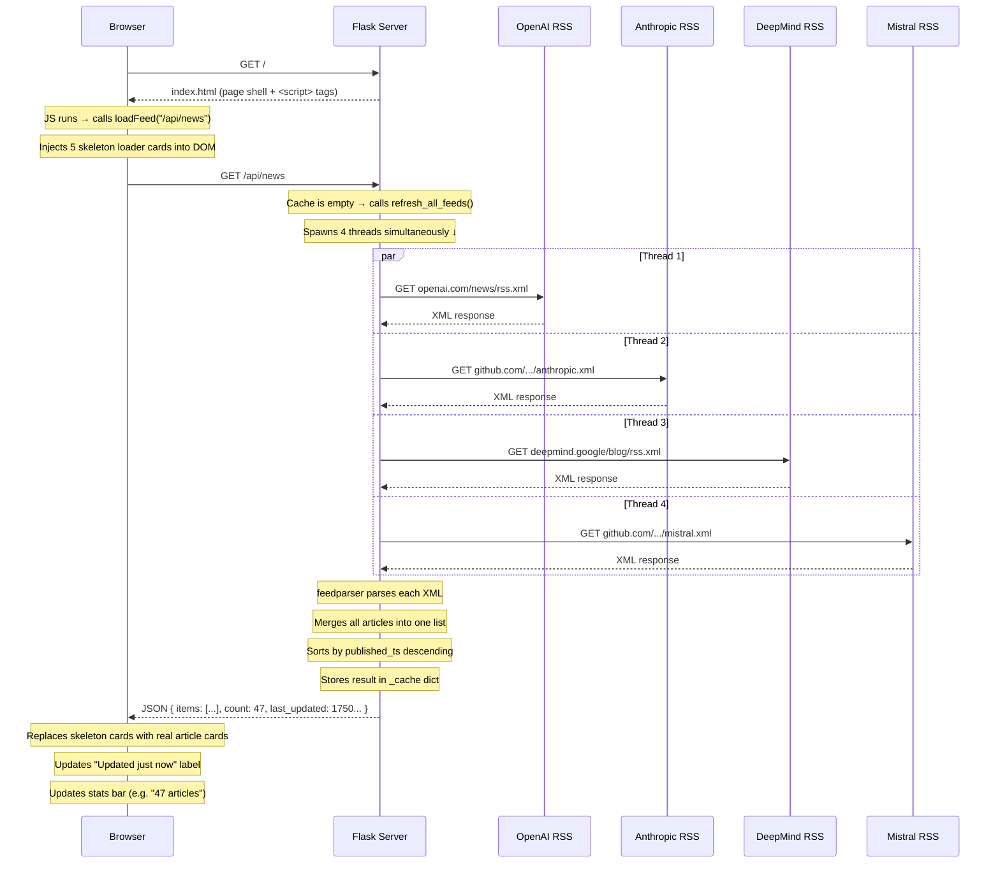
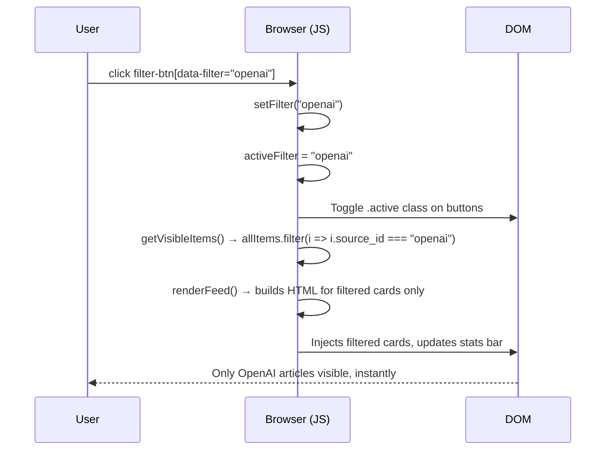
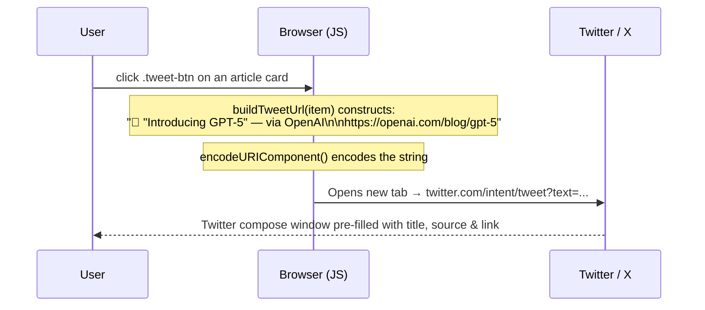

# AI Pulse — Technical Deep Dive

## What the App Does (in one sentence)

Every time a user visits the page or hits **Refresh**, the Flask server fetches RSS feeds from four AI companies **concurrently**, merges and sorts all articles by date, caches the result, and returns clean JSON to the browser — which then renders the cards, handles filtering, and builds tweet links entirely on the client side.

---

## Main Features at a Glance

| Feature | Where it lives | How it works |
|---|---|---|
| RSS feed fetching | Server | `requests.get()` on 4 URLs, parsed with `feedparser` |
| Concurrent fetching | Server | 4 `threading.Thread` workers running in parallel |
| 5-min cache | Server | Python `dict` + `time.time()` comparison |
| Force refresh | Server | `/api/news/refresh` bypasses the cache TTL check |
| Merging + sorting | Server | `list.sort(key=published_ts, reverse=True)` |
| Card rendering | Client | JS builds HTML strings from JSON array |
| Filter bar | Client | JS filters the local `allItems` array in memory |
| Relative timestamps | Client | JS `Date` math, auto-refreshed every 60s |
| Tweet intent | Client | JS builds a `twitter.com/intent/tweet?text=...` URL |
| Skeleton loaders | Client | Placeholder HTML injected before fetch resolves |

---

## Server Side — `app.py`

The Flask backend has one job: **get clean JSON to the browser as fast as possible.**

```
app.py
│
├── FEEDS[]              ← Config: name, URL, color for each company
│
├── fetch_feed(cfg)      ← Fetches ONE feed, parses it, returns list of dicts
├── refresh_all_feeds()  ← Spawns 4 threads → calls fetch_feed() concurrently
├── get_cached_items()   ← Cache gate: returns cached data or triggers refresh
│
├── GET /                ← Renders index.html (the shell page)
├── GET /api/news        ← Returns cached JSON
└── GET /api/news/refresh ← Bypasses cache, fetches fresh data, returns JSON
```

### Key Design Decisions

**Why threads instead of async?**
Python's `feedparser` and `requests` are synchronous libraries. Using `threading.Thread` lets us fire all 4 HTTP requests at the same time without switching to `asyncio`. Total wait time becomes the slowest single feed, not the sum of all four.

```
Without threads:  OpenAI(2s) + Anthropic(1s) + DeepMind(3s) + Mistral(1s) = ~7s
With 4 threads:   max(2s, 1s, 3s, 1s)                                      = ~3s
```

**The cache dict**
```python
_cache = {
    "items": [],          # the merged, sorted article list
    "last_updated": None  # Unix timestamp of last successful fetch
}
```
Every request checks: `(now - last_updated) > 300`. If stale → refresh. If fresh → return immediately. The `/api/news/refresh` endpoint skips this check entirely.

**What each article dict looks like (what the server sends)**
```json
{
  "id":            "https://openai.com/blog/gpt-5",
  "title":         "Introducing GPT-5",
  "link":          "https://openai.com/blog/gpt-5",
  "summary":       "GPT-5 is our most capable model yet...",
  "published_iso": "2026-06-15T10:00:00+00:00",
  "published_ts":  1750000000.0,
  "source_id":     "openai",
  "source_name":   "OpenAI",
  "source_color":  "#10a37f"
}
```

---

## Client Side — `app.js` + `style.css`

The browser receives a JSON payload and does everything else from there. No page reloads, no server round-trips for filtering.

```
app.js
│
├── State
│   ├── allItems[]       ← Full article list from the API (never mutated)
│   └── activeFilter     ← "all" | "openai" | "anthropic" | "deepmind" | "mistral"
│
├── loadFeed(url)        ← fetch() → updates allItems → calls renderFeed()
├── refreshFeed()        ← calls loadFeed("/api/news/refresh")
│
├── setFilter(value)     ← updates activeFilter, highlights button, calls renderFeed()
├── getVisibleItems()    ← filters allItems by activeFilter
├── renderFeed()         ← maps visible items → buildCardHTML() → injects into DOM
│
├── buildCardHTML(item)  ← returns an <article> HTML string for one news card
├── buildTweetUrl(item)  ← encodes title + source + link into a Twitter intent URL
├── relativeTime(iso)    ← "2h ago", "3d ago", etc.
└── updateStats()        ← updates article count + per-source pill badges
```

### Why filter on the client instead of the server?

Once the browser has `allItems`, filtering is just an array `.filter()` call — **instantaneous**, no network round-trip. The full dataset for all 4 feeds is typically under 50KB of JSON, well within reason to hold in memory.

---

## Sample Flow: User Opens the App for the First Time

Here's exactly what happens from browser tab open to articles on screen:



---

## Sample Flow: User Clicks the "OpenAI" Filter Button

No network request is made. Everything happens in the browser in **< 1ms**.



---

## Sample Flow: User Clicks "Tweet" on an Article

Again, zero server involvement. Pure client-side URL construction.



---

## Data Flow Summary

```
RSS Feeds (XML)
    │
    ▼
feedparser           ← parses XML into Python objects
    │
    ▼
fetch_feed()         ← extracts title, link, summary, date, source
    │  (x4 in parallel threads)
    ▼
refresh_all_feeds()  ← merges lists, sorts by timestamp
    │
    ▼
_cache dict          ← stored in memory for 5 minutes
    │
    ▼
/api/news            ← serialized as JSON by Flask's jsonify()
    │
    ▼
fetch() in app.js    ← browser receives the payload
    │
    ▼
allItems[]           ← stored in JS memory
    │
    ├── renderFeed()     → builds card HTML → injected into #feed div
    ├── setFilter()      → filters allItems → re-renders cards
    └── buildTweetUrl()  → constructs Twitter intent URL per card
```

---

> **TL;DR** — The server fetches, parses, caches, and serves. The client renders, filters, and tweets. They communicate through one clean JSON API endpoint, and the two sides are completely decoupled.
